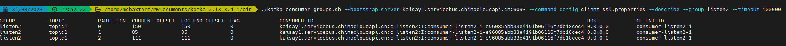

# Spring-Kafka 连接 Azure EventHub
Eventhub 为standard tier，kafka client连接需要启用SASL
# Kafka 工具类配置
* Kafka client version kafka_2.13-3.4.1
* Java Version ："20.0.2" 2023-07-18
* 添加JVM参数  -Djava.security.auth.login.config=kafka_client_jaas.conf
* Kafka的官方文档没有说明jaas auth 格式需要包含特别的格式，如下

需要指定Block 内包含描述内容

    KafkaClient {
        ...
    };

在kafka client bin 路径下创建两个空文件 
* kafka_client_jaas.conf
* client-ssl.properties

修改client启动脚本kafka-run-class.sh，加入参数java.security.auth.login.config=kafka_client_jaas.conf，比如再Memory Option中加入，或者其他任何地方加入到环境变量或者JVM启动参数中

    # Memory options
    if [ -z "$KAFKA_HEAP_OPTS" ]; then
        KAFKA_HEAP_OPTS="-Xmx256M -Djava.security.auth.login.config=kafka_client_jaas.conf"
    fi

kafka_client_jaas.conf：

    KafkaClient {
        org.apache.kafka.common.security.plain.PlainLoginModule required
        username="$ConnectionString"
        password="Endpoint=sb://kaisay1.servicebus.chinacloudapi.cn/;SharedAccessKeyName=RootManageSharedAccessKey;SharedAccessKey=21BohSL6Hy652YFSnsUMNXw6i+zDPsznp+AEhKZaszY=";
    };

client-ssl.properties：

    security.protocol=SASL_SSL
    sasl.mechanism=PLAIN

执行脚本
>./kafka-consumer-groups.sh --bootstrap-server kaisay1.servicebus.chinacloudapi.cn:9093 --command-config client-ssl.properties --describe --group listen2 --timeout 100000

Output:

